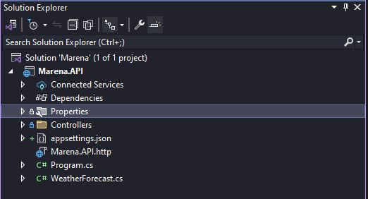

# Copilot Training - .NET 8 + Entity Framework Core.

Aplicacion Web API de demostración para implementaciones de Gihub Copilot enfocadas en el framework .NET 8.
- Crear y configurar un nuevo proyecto dotnet api.
- Configurar conexion a bases de datos.
- Abstraccion de servicios
- Configuracion de metodos CRUD y Controladores REST.

## Paso 1: Crear un proyecto .NET API utilizando Github Copilot CLI.

1. Consultar a copilot CLI el comando para generar un nuevo proyecto .NET API
```powershell
ghcs "How to create a .NET API project"
```
_Respuesta Copilot CLI_:
```powershell
Suggestion:

  dotnet new webapi --use-controllers -n YourProjectName

? Select an option
> Copy command to clipboard
  Explain command
  Execute command
  Revise command
  Rate response
  exit
```

2. Seleccionamos la opcion `Copy command to clipboard` y cambiamos el nombre del proyecto por Marena.API
```powershell
dotnet new webapi --use-controllers -n Marena.API
```

3. Generamos un nuevo archivo de solucion llamado **Marena**
```powershell
dotnet new sln -n Marena
```

4. Usamos copilot CLI para agregar el proyecto Marena.API al archivo de solucion que hemos creado en el paso anterior.
```powershell
ghcs "How to add Marena.API project to Marena solution file"
```
_Respuesta Copilot CLI:_
```powershell
dotnet sln Marena.sln add Marena.API/Marena.API.csproj
```
5. Abrir archivo de solucion con **Visual Studio**.

_Estructura del proyecto obtenida:_



## Paso 2. Crear un contenedor Docker para ejecutar SQL Server.

1. Creamos un contenedor docker de SQL Server.
```powershell
ghcs "How can i run SQL Server in docker?"
```
- ` docker run -e 'ACCEPT_EULA=Y' -e 'SA_PASSWORD=YourPassword123' -p 1433:1433 -d mcr.microsoft.com/mssql/server:2019-latest`
- Si no tienes Docker instalado en tu PC puedes instalarlo desde [aquí](https://www.docker.com/products/docker-desktop).
- Si Docker es una limitante, puedes instalar SQL Server Express desde [aquí](https://www.microsoft.com/en-us/sql-server/sql-server-downloads).

2. Validar conexion con SQL Server.
> Puedes probar la conexion utilizando cualquier herramienta de gestion de bases de datos como SQL Server Management Studio, Azure Data Studio, DBeaver o Datagrip.

## Paso 3. Configurar Entity Framework Core.

1. Usando Copilot CLI, generamos los comandos a utilizar.
```powershell
ghcs "How to install and setup Entity Framework Core"
```
- `dotnet add package Microsoft.EntityFrameworkCore`
- `dotnet add package Microsoft.EntityFrameworkCore.Tools`
- `dotnet add package Microsoft.EntityFrameworkCore.Design`

## Paso 4. Configuramos el DBContext.

1. Usando Copilot Chat, solicitamos generar una clase que herede de DBContext.

- Create a class named `MarenaDBContext` taht inherits from `DBContext`
```C#
using Microsoft.EntityFrameworkCore;

public class MarenaDBContext : DbContext
{
    public MarenaDBContext(DbContextOptions<MarenaDBContext> options) : base(options)
    {
    }

    // Define DbSet properties for your entities here
    // public DbSet<YourEntity> YourEntities { get; set; }
}
```
2. Generamos una carpeta llamada `Persistence` y agregamos la clase `MarenaDBContext` dentro de esa carpeta.

3. Registramos la clase MarenaDBContext en los servicios cargados por el builder en el archivo Program.cs
- Register the `MarenaDBContext` in the `builder.services` method in the `Program.cs` file.
```C#
// Register MarenaDBContext with the dependency injection container
builder.Services.AddDbContext<MarenaDBContext>(options =>
    options.UseSqlServer(builder.Configuration.GetConnectionString("DefaultConnection")));
```
4. Configuramos la cadena de conexion por defecto a la base de datos SQL Server.
- Add default connection string to `appsettings.json`
```json
{
  "ConnectionStrings": {
    "DefaultConnection": "Server=your_server_name;Database=your_database_name;User Id=your_user_id;Password=your_password;"
  }
}
```
### Troubleshooting

#### UseSqlServer
Puede pasar que a estas alturas, se nos genere un error al momento de llamar al metodo `UseSqlServer`, utilizando Copilot podemos investigar la causa del error.
Para solventarlo realziamos lo siguiente:

- Seleccionamos el metodo que acabamos de agregar.
- Hacemos click derecho sobre la seleccion y seleccionamos la opcion "ask copilot"
- En la ventana de chat, usamos el comando `/explain`
- `/explain Why the UseSqlServer is highlighted as an error?`

Copilot nos menciona que hemos olvidado incorporar la referencia al paquete `Microsoft.EntityFrameworkCore.SqlServer`. Existen diversas formas de incorporar este paquete al proyecto, para esta ocasion usaremos la linea de comandos de `dotnet`
```powershell
dotnet add package Microsoft.EntityFrameworkCore.SqlServer
```

#### Trust Server Certificate.
- Add to connection string: TrustServerCertificate=True;

## Paso 5. Configurando Migraciones y Entidad Movies

1. Utilizando Copilot Chat preguntemos como generar una entidad llamada Movie, que contenga los siguientes atributos: Id, Name, Score, Genres, Year
- Generate an entity named Movie with the following attributes: `Id`, `Name`, `Score`, `Genres`, `Year`, use Entity Framework Core Schema validations

```C#
using System.ComponentModel.DataAnnotations;
using System.ComponentModel.DataAnnotations.Schema;

public class Movie
{
    [Key]
    [DatabaseGenerated(DatabaseGeneratedOption.Identity)]
    public int Id { get; set; }

    [Required]
    [MaxLength(100)]
    public string Name { get; set; }

    [Range(0, 10)]
    public double Score { get; set; }

    [Required]
    [MaxLength(200)]
    public string Genres { get; set; }

    [Range(1888, 2100)]
    public int Year { get; set; }
}
```
2. Agregamos manualmente el modelo dentro del DBContext que se ha definido anteriormente.
```C#
using Microsoft.EntityFrameworkCore;

public class MarenaDBContext : DbContext
{
    public MarenaDBContext(DbContextOptions<MarenaDBContext> options) : base(options)
    {
    }

    // Define DbSet properties for your entities here
    public DbSet<Movie> Movies { get; set; }
}
```

3. Con ayuda de Copilot CLI, solicitamos como generar las migraciones para crear la base de datos y la tabla Movie
```powershell
ghcs "What is the command to create migrations with Entity Framework Core?"
```
- `dotnet ef migrations add Initial_Migration`
- `dotnet ef database update`

## Paso 6. Agregamos el controlador para la entidad Movie

1. Empleando la herramienta de Copilot Chat, generaremos un controlador basado en la entidad `Movies` generada anteriormente.
- `Create a .NET API Controller for #Movie.Cs Entity` Notese, como acá usamos las referencias de archivos con la sintaxis "#[fileName]" en el chat.

```C#
using Microsoft.AspNetCore.Mvc;
using Microsoft.EntityFrameworkCore;

namespace Marena.API.Controllers
{
    [Route("api/[controller]")]
    [ApiController]
    public class MoviesController : ControllerBase
    {
        private readonly MarenaDBContext _context;

        public MoviesController(MarenaDBContext context)
        {
            _context = context;
        }

        // GET: api/Movies
        [HttpGet]
        public async Task<ActionResult<IEnumerable<Movie>>> GetMovies()
        {
            return await _context.Movies.ToListAsync();
        }

        // GET: api/Movies/5
        [HttpGet("{id}")]
        public async Task<ActionResult<Movie>> GetMovie(int id)
        {
            var movie = await _context.Movies.FindAsync(id);

            if (movie == null)
            {
                return NotFound();
            }

            return movie;
        }

        // PUT: api/Movies/5
        [HttpPut("{id}")]
        public async Task<IActionResult> PutMovie(int id, Movie movie)
        {
            if (id != movie.Id)
            {
                return BadRequest();
            }

            _context.Entry(movie).State = EntityState.Modified;

            try
            {
                await _context.SaveChangesAsync();
            }
            catch (DbUpdateConcurrencyException)
            {
                if (!MovieExists(id))
                {
                    return NotFound();
                }
                else
                {
                    throw;
                }
            }

            return NoContent();
        }

        // POST: api/Movies
        [HttpPost]
        public async Task<ActionResult<Movie>> PostMovie(Movie movie)
        {
            _context.Movies.Add(movie);
            await _context.SaveChangesAsync();

            return CreatedAtAction(nameof(GetMovie), new { id = movie.Id }, movie);
        }

        // DELETE: api/Movies/5
        [HttpDelete("{id}")]
        public async Task<IActionResult> DeleteMovie(int id)
        {
            var movie = await _context.Movies.FindAsync(id);
            if (movie == null)
            {
                return NotFound();
            }

            _context.Movies.Remove(movie);
            await _context.SaveChangesAsync();

            return NoContent();
        }

        private bool MovieExists(int id)
        {
            return _context.Movies.Any(e => e.Id == id);
        }
    }
}
```
- Agregamos este archivo con el nombre de `MoviesController.cs` bajo la carpeta de `Controllers`
- Ejecutamos la aplicacion directamente desde Visual Studio.
- Probamos el API mediante algun cliente como Postman, Insomnia o Swagger.

## Paso 7. Abstraccion de la logica a Servicios.

Una buena practica de desarrollo, consiste en abstraer la logica existente en Controladores a una clase servicio, que permita implementar diferentes acciones del negocio. Delegando a los controladores la exclusiva responsabilidad de gestionar la entrada y salida de datos del API.

1. Indicamos a Copilot Chat que genere la estructura de la clase servicio.
```
Create a Service Class That contains all the logic for CRUD operations of #Models.cs Entity and implement it on #MoviesController.cs
```
2. Creamos una carpeta llamada `Services` y dentro de ella dos subcarpetas llamadas `Interfaces` e `Implementations` en donde colocaremos las interfaces y los servicios respectivamente.
   
3. Incorporamos las sugerencias de codigo proporcionadas por Copilot Chat segun corresponda.

- Insertamos un nuevo archivo con el contenido de la interfaz `IMovieService` en la carpeta `Interfaces`
```C#
using Marena.API.Models;
using System.Collections.Generic;
using System.Threading.Tasks;

public interface IMovieService
{
    Task<IEnumerable<Movie>> GetMoviesAsync();
    Task<Movie> GetMovieByIdAsync(int id);
    Task<Movie> AddMovieAsync(Movie movie);
    Task<Movie> UpdateMovieAsync(int id, Movie movie);
    Task<bool> DeleteMovieAsync(int id);
}

```
- Insertamos un nuevo archivo con el contenido de la implementacion del servicio llamado `MovieService` en la carpeta `Implementations`
```C#
using Marena.API.Models;
using Microsoft.EntityFrameworkCore;
using System.Collections.Generic;
using System.Threading.Tasks;

public class MovieService : IMovieService
{
    private readonly MarenaDBContext _context;

    public MovieService(MarenaDBContext context)
    {
        _context = context;
    }

    public async Task<IEnumerable<Movie>> GetMoviesAsync()
    {
        return await _context.Movies.ToListAsync();
    }

    public async Task<Movie> GetMovieByIdAsync(int id)
    {
        return await _context.Movies.FindAsync(id);
    }

    public async Task<Movie> AddMovieAsync(Movie movie)
    {
        _context.Movies.Add(movie);
        await _context.SaveChangesAsync();
        return movie;
    }

    public async Task<Movie> UpdateMovieAsync(int id, Movie movie)
    {
        if (id != movie.Id)
        {
            return null;
        }

        _context.Entry(movie).State = EntityState.Modified;

        try
        {
            await _context.SaveChangesAsync();
        }
        catch (DbUpdateConcurrencyException)
        {
            if (!await MovieExistsAsync(id))
            {
                return null;
            }
            else
            {
                throw;
            }
        }

        return movie;
    }

    public async Task<bool> DeleteMovieAsync(int id)
    {
        var movie = await _context.Movies.FindAsync(id);
        if (movie == null)
        {
            return false;
        }

        _context.Movies.Remove(movie);
        await _context.SaveChangesAsync();
        return true;
    }

    private async Task<bool> MovieExistsAsync(int id)
    {
        return await _context.Movies.AnyAsync(e => e.Id == id);
    }
}
```
- Actualizamos el codigo del controlador `MoviesController.cs` con la implementacion de los metodos del servicio `MoviesService`
```C#
using Marena.API.Models;
using Microsoft.AspNetCore.Mvc;
using System.Collections.Generic;
using System.Threading.Tasks;

namespace Marena.API.Controllers
{
    [Route("api/[controller]")]
    [ApiController]
    public class MoviesController : ControllerBase
    {
        private readonly IMovieService _movieService;

        public MoviesController(IMovieService movieService)
        {
            _movieService = movieService;
        }

        // GET: api/Movies
        [HttpGet]
        public async Task<ActionResult<IEnumerable<Movie>>> GetMovies()
        {
            var movies = await _movieService.GetMoviesAsync();
            return Ok(movies);
        }

        // GET: api/Movies/5
        [HttpGet("{id}")]
        public async Task<ActionResult<Movie>> GetMovie(int id)
        {
            var movie = await _movieService.GetMovieByIdAsync(id);

            if (movie == null)
            {
                return NotFound();
            }

            return Ok(movie);
        }

        // PUT: api/Movies/5
        [HttpPut("{id}")]
        public async Task<IActionResult> PutMovie(int id, Movie movie)
        {
            var updatedMovie = await _movieService.UpdateMovieAsync(id, movie);

            if (updatedMovie == null)
            {
                return BadRequest();
            }

            return NoContent();
        }

        // POST: api/Movies
        [HttpPost]
        public async Task<ActionResult<Movie>> PostMovie(Movie movie)
        {
            var createdMovie = await _movieService.AddMovieAsync(movie);
            return CreatedAtAction(nameof(GetMovie), new { id = createdMovie.Id }, createdMovie);
        }

        // DELETE: api/Movies/5
        [HttpDelete("{id}")]
        public async Task<IActionResult> DeleteMovie(int id)
        {
            var result = await _movieService.DeleteMovieAsync(id);

            if (!result)
            {
                return NotFound();
            }

            return NoContent();
        }
    }
}

```

- Registramos la inyeccion de depencias del servicio `MoviesService` y la interfaz `IMoviesService` en el metodo `Builder.service` del archivo `Program.cs`
```C#
// Register the MovieService
builder.Services.AddScoped<IMovieService, MovieService>();
```

4. Ejecutamos el API nuevamente y probamos el funcionamiento correcto de los metodos CRUD.

## Paso 8. Creamos las pruebas unitarias para el servicio de Movies Service.
Empleando Copilot Chat, se le solicita la construiccion de los test unitarios mediante el siguiente prompt:
```
Create unit tests for the #file:'MoviesService.cs' in the #file:'Marena.Tests.csproj' Project
```
_Resultado del prompt:_

1. Se agregan los paquetes necesarios:

```powershell
dotnet add package xunit
dotnet add package Moq
dotnet add package coverlet.collector
dotnet add package Microsoft.NET.Test.Sdk
dotnet add package xunit.runner.visualstudio
dotnet add package Microsoft.EntityFrameworkCore.InMemory
```

2. Se crea una clase llamada `MovieServiceTests` en el proyecto `Marena.Tests`

```C#
using Marena.API.Models;
using Marena.API.Persistence;
using Marena.API.Services.Interfaces;
using Microsoft.EntityFrameworkCore;

public class MovieServiceTests : IDisposable
{
    private readonly MarenaDBContext _context;
    private readonly IMovieService _movieService;

    public MovieServiceTests()
    {
        var options = new DbContextOptionsBuilder<MarenaDBContext>()
            .UseInMemoryDatabase(databaseName: Guid.NewGuid().ToString())
            .Options;

        _context = new MarenaDBContext(options);
        _movieService = new MovieService(_context);
    }

    [Fact]
    public async Task GetMoviesAsync_ReturnsAllMovies()
    {
        // Arrange
        var movies = new List<Movie>
        {
            new Movie { Id = 1, Name = "Movie 1", Score = 8.5, Genres = "Action", Year = 2020 },
            new Movie { Id = 2, Name = "Movie 2", Score = 7.0, Genres = "Drama", Year = 2019 }
        };

        await _context.Movies.AddRangeAsync(movies);
        await _context.SaveChangesAsync();

        // Act
        var result = await _movieService.GetMoviesAsync();

        // Assert
        Assert.Equal(2, result.Count());
    }

    [Fact]
    public async Task GetMovieByIdAsync_ReturnsMovie()
    {
        // Arrange
        var movie = new Movie { Id = 1, Name = "Movie 1", Score = 8.5, Genres = "Action", Year = 2020 };
        await _context.Movies.AddAsync(movie);
        await _context.SaveChangesAsync();

        // Act
        var result = await _movieService.GetMovieByIdAsync(1);

        // Assert
        Assert.Equal(movie, result);
    }

    [Fact]
    public async Task AddMovieAsync_AddsMovie()
    {
        // Arrange
        var movie = new Movie { Id = 1, Name = "Movie 1", Score = 8.5, Genres = "Action", Year = 2020 };

        // Act
        var result = await _movieService.AddMovieAsync(movie);

        // Assert
        var addedMovie = await _context.Movies.FindAsync(movie.Id);
        Assert.Equal(movie, addedMovie);
    }

    [Fact]
    public async Task UpdateMovieAsync_UpdatesMovie()
    {
        // Arrange
        var movie = new Movie { Id = 1, Name = "Movie 1", Score = 8.5, Genres = "Action", Year = 2020 };
        await _context.Movies.AddAsync(movie);
        await _context.SaveChangesAsync();

        movie.Name = "Updated Movie 1";

        // Act
        var result = await _movieService.UpdateMovieAsync(1, movie);

        // Assert
        var updatedMovie = await _context.Movies.FindAsync(movie.Id);
        Assert.Equal("Updated Movie 1", updatedMovie.Name);
    }

    [Fact]
    public async Task DeleteMovieAsync_DeletesMovie()
    {
        // Arrange
        var movie = new Movie { Id = 1, Name = "Movie 1", Score = 8.5, Genres = "Action", Year = 2020 };
        await _context.Movies.AddAsync(movie);
        await _context.SaveChangesAsync();

        // Act
        var result = await _movieService.DeleteMovieAsync(1);

        // Assert
        var deletedMovie = await _context.Movies.FindAsync(1);
        Assert.Null(deletedMovie);
        Assert.True(result);
    }

    public void Dispose()
    {
        _context.Database.EnsureDeleted();
        _context.Dispose();
    }
}
```

3. Se ejecutan los tests.

Para ejecutar los tests se realiza de la siguiente manera:

#### Usando Visual Studio
- Abrir la solucion.
- Compilar la solucion.
- Abrir el explorador de pruebas Test > Test Explorer.
- Ejecutar todas las pruebas (Run All Tests).

#### Usando .NET CLI
- Usando la terminal navegar hacia la ruta del proyecto `Marena.Tests`
```powershell
cd path/to/Marena.Tests
```
- Ejecutar el comando de ejecucion de pruebas
```powershell
dotnet test
```


