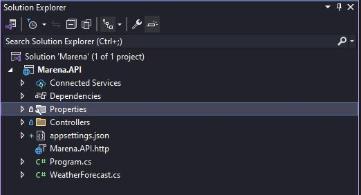
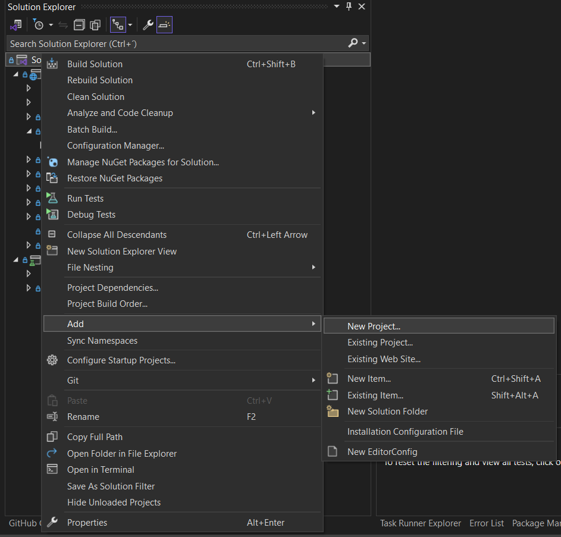

# Copilot Training - .NET 8 + Entity Framework Core

Demo Web API application for GitHub Copilot implementations focused on the .NET 8 framework.
- Create and configure a new dotnet api project.
- Configure database connection.
- Service abstraction.
- Configure CRUD methods and REST Controllers.

## Step 1: Create a .NET API project using GitHub Copilot CLI.

1. Ask Copilot CLI for the command to generate a new .NET API project
```powershell
gh copilot suggest "How to create a .NET webapi project"
```
_Copilot CLI Response_:
```powershell
Suggestion:

  dotnet new webapi --use-controllers -n YourProjectName

? Select an option
> Copy command to clipboard
  Explain command
  Execute command
  Revise command
  Rate response
  exit
```

2. Select the `Copy command to clipboard` option and change the project name to Marena.API
```powershell
dotnet new webapi --use-controllers -n Marena.API
```

3. Generate a new solution file named **Marena**
```powershell
dotnet new sln -n Marena
```

4. Use Copilot CLI to add the Marena.API project to the solution file created in the previous step.
```powershell
gh copilot suggest "How can I add the Marena.API project to a solution file .sln"
```
_Copilot CLI Response_:
```powershell
dotnet sln Marena.sln add Marena.API/Marena.API.csproj
```
5. Open the solution file with **Visual Studio**.

_Project structure obtained:_



## Step 2. Create a Docker container to run SQL Server.

1. Create a SQL Server docker container.
    ```powershell
    gh copilot suggest "How can I run Microsoft SQL Server in a docker container?"
    ```
- `docker run -e 'ACCEPT_EULA=Y' -e 'SA_PASSWORD=YourPassword123' -p 1433:1433 -d mcr.microsoft.com/mssql/server:2019-latest`
- If you don't have Docker installed on your PC, you can install it from [here](https://www.docker.com/products/docker-desktop).
- If Docker is a limitation, you can install SQL Server Express from [here](https://www.microsoft.com/en-us/sql-server/sql-server-downloads).

2. Validate connection with SQL Server.
> You can test the connection using any database management tool like SQL Server Management Studio, Azure Data Studio, DBeaver, or Datagrip.

## Step 3. Configure Entity Framework Core.

1. Using Copilot CLI, generate the commands to use.
```powershell
gh copilot suggest "How can I correctly install and configure Entity Framework Core?"
```
- `dotnet add package Microsoft.EntityFrameworkCore`
- `dotnet add package Microsoft.EntityFrameworkCore.Tools`
- `dotnet add package Microsoft.EntityFrameworkCore.Design`

## Step 4. Configure the DBContext.

1. Using Copilot Chat, request to generate a class that inherits from DBContext.
    ```
    Create a class named MarenaDBContext that inherits from DBContext
    ```
    ```C#
    using Microsoft.EntityFrameworkCore;

    public class MarenaDBContext : DbContext
    {
        public MarenaDBContext(DbContextOptions<MarenaDBContext> options) : base(options)
        {
        }

        // Define DbSet properties for your entities here
        // public DbSet<YourEntity> YourEntities { get; set; }
    }
    ```

2. Create a folder named `Persistence` and add the `MarenaDBContext` class suggested by Copilot inside that folder (Using the "Copy" or "Insert in new file" button).

3. Register the MarenaDBContext class in the services loaded by the builder in the Program.cs file.
    ```
    Register the MarenaDBContext in the `builder.services` method in the Program.cs file
    ```
    ```C#
    // Register MarenaDBContext with the dependency injection container
    builder.Services.AddDbContext<MarenaDBContext>(options =>
        options.UseSqlServer(builder.Configuration.GetConnectionString("DefaultConnection")));
    ```

4. Configure the default connection string to the SQL Server database.
    ```
    Add default connection string to appsettings.json
    ```
    ```json
    {
    "ConnectionStrings": {
        "DefaultConnection": "Server=your_server_name;Database=your_database_name;User Id=your_user_id;Password=your_password;"
    }
    }
    ```
### Troubleshooting

#### UseSqlServer
It may happen that at this point, an error is generated when calling the `UseSqlServer` method. Using Copilot, we can investigate the cause of the error.
To solve it, we do the following:

- Select the method we just added.
- Right-click on the selection and select the "ask copilot" option.
- In the chat window, use the `/explain` command.
- `/explain Why the UseSqlServer is highlighted as an error?`

Copilot mentions that we forgot to add the reference to the `Microsoft.EntityFrameworkCore.SqlServer` package. There are several ways to add this package to the project, for this occasion we will use the `dotnet` command line.
```powershell
dotnet add package Microsoft.EntityFrameworkCore.SqlServer
```

#### Trust Server Certificate.
- Add this value at the end of the connection string: TrustServerCertificate=True;

    ```json
    {
        "ConnectionStrings": {
            "DefaultConnection": "Server=your_server_name;Database=your_database_name;User Id=your_user_id;Password=your_password;TrustServerCertificate=True;"
        }
    }
    ```

## Step 5. Configure Migrations and Movie Entity

1. Using Copilot Chat, ask how to generate an entity named Movie, which contains the following attributes: Id, Name, Score, Genres, Year.
    ```
    Generate an entity named Movie with the following attributes: Id, Name, Score, Genres, Year. Use Entity Framework Core Schema validations
    ```
    ```C#
    using System.ComponentModel.DataAnnotations;
    using System.ComponentModel.DataAnnotations.Schema;

    public class Movie
    {
        [Key]
        [DatabaseGenerated(DatabaseGeneratedOption.Identity)]
        public int Id { get; set; }

        [Required]
        [MaxLength(100)]
        public string Name { get; set; }

        [Range(0, 10)]
        public double Score { get; set; }

        [Required]
        [MaxLength(200)]
        public string Genres { get; set; }

        [Range(1888, 2100)]
        public int Year { get; set; }
    }
    ```

2. Manually add the model to the previously defined DBContext.
    ```C#
    using Microsoft.EntityFrameworkCore;

    public class MarenaDBContext : DbContext
    {
        public MarenaDBContext(DbContextOptions<MarenaDBContext> options) : base(options)
        {
        }

        // Define DbSet properties for your entities here
        public DbSet<Movie> Movies { get; set; }
    }
    ```

3. With the help of Copilot Chat, ask how to generate migrations to create the database and the Movie table.

    ```
    What is the command to create migrations with Entity Framework Core?
    ```
    Copilot will possibly suggest two response options:

    **If we run everything from the Nuget Package Manager Console in Visual Studio**
    - `Add-Migration Initial_Migration`
    - `Update-Database`

    **If we run everything from a terminal using dotnet cli**
    - `dotnet ef migrations add Initial_Migration`
    - `dotnet ef database update`

## Step 6. Add the controller for the Movie entity

1. Using the Copilot Chat tool, generate a controller based on the `Movies` entity created earlier.

    ```
    Create a .NET API Controller for #Movie.Cs Entity
    ```
Note, here we use file references with the syntax "#[fileName]" in the chat.

    ```C#
    using Microsoft.AspNetCore.Mvc;
    using Microsoft.EntityFrameworkCore;

    namespace Marena.API.Controllers
    {
        [Route("api/[controller]")]
        [ApiController]
        public class MoviesController : ControllerBase
        {
            private readonly MarenaDBContext _context;

            public MoviesController(MarenaDBContext context)
            {
                _context = context;
            }

            // GET: api/Movies
            [HttpGet]
            public async Task<ActionResult<IEnumerable<Movie>>> GetMovies()
            {
                return await _context.Movies.ToListAsync();
            }

            // GET: api/Movies/5
            [HttpGet("{id}")]
            public async Task<ActionResult<Movie>> GetMovie(int id)
            {
                var movie = await _context.Movies.FindAsync(id);

                if (movie == null)
                {
                    return NotFound();
                }

                return movie;
            }

            // PUT: api/Movies/5
            [HttpPut("{id}")]
            public async Task<IActionResult> PutMovie(int id, Movie movie)
            {
                if (id != movie.Id)
                {
                    return BadRequest();
                }

                _context.Entry(movie).State = EntityState.Modified;

                try
                {
                    await _context.SaveChangesAsync();
                }
                catch (DbUpdateConcurrencyException)
                {
                    if (!MovieExists(id))
                    {
                        return NotFound();
                    }
                    else
                    {
                        throw;
                    }
                }

                return NoContent();
            }

            // POST: api/Movies
            [HttpPost]
            public async Task<ActionResult<Movie>> PostMovie(Movie movie)
            {
                _context.Movies.Add(movie);
                await _context.SaveChangesAsync();

                return CreatedAtAction(nameof(GetMovie), new { id = movie.Id }, movie);
            }

            // DELETE: api/Movies/5
            [HttpDelete("{id}")]
            public async Task<IActionResult> DeleteMovie(int id)
            {
                var movie = await _context.Movies.FindAsync(id);
                if (movie == null)
                {
                    return NotFound();
                }

                _context.Movies.Remove(movie);
                await _context.SaveChangesAsync();

                return NoContent();
            }

            private bool MovieExists(int id)
            {
                return _context.Movies.Any(e => e.Id == id);
            }
        }
    }
    ```
    - Add this file with the name `MoviesController.cs` under the `Controllers` folder.
    - Run the application directly from Visual Studio.
    - Test the API using a client like **Postman**, **Insomnia**, or **Swagger**.

## Step 7. Abstract logic to Services.

A good development practice is to abstract the existing logic in Controllers to a service class, which allows implementing different business actions. Delegating to the controllers the exclusive responsibility of managing the input and output of API data.

1. Ask Copilot Chat to generate the structure of the service class.
    ```
    Create a service class that contains all the logic for CRUD operations of the #Models.cs entity and implement it in #MoviesController.cs.
    ```
2. Create a folder named `Services` and within it two subfolders named `Interfaces` and `Implementations` where we will place the interfaces and services respectively.
   
3. Incorporate the code suggestions provided by Copilot Chat as appropriate.

4. Insert a new file with the content of the `IMovieService` interface in the `Interfaces` folder.
    ```C#
    using Marena.API.Models;
    using System.Collections.Generic;
    using System.Threading.Tasks;

    public interface IMovieService
    {
        Task<IEnumerable<Movie>> GetMoviesAsync();
        Task<Movie> GetMovieByIdAsync(int id);
        Task<Movie> AddMovieAsync(Movie movie);
        Task<Movie> UpdateMovieAsync(int id, Movie movie);
        Task<bool> DeleteMovieAsync(int id);
    }
    ```

5. Insert a new file with the content of the `MovieService` implementation in the `Implementations` folder.
    ```C#
    using Marena.API.Models;
    using Microsoft.EntityFrameworkCore;
    using System.Collections.Generic;
    using System.Threading.Tasks;

    public class MovieService : IMovieService
    {
        private readonly MarenaDBContext _context;

        public MovieService(MarenaDBContext context)
        {
            _context = context;
        }

        public async Task<IEnumerable<Movie>> GetMoviesAsync()
        {
            return await _context.Movies.ToListAsync();
        }

        public async Task<Movie> GetMovieByIdAsync(int id)
        {
            return await _context.Movies.FindAsync(id);
        }

        public async Task<Movie> AddMovieAsync(Movie movie)
        {
            _context.Movies.Add(movie);
            await _context.SaveChangesAsync();
            return movie;
        }

        public async Task<Movie> UpdateMovieAsync(int id, Movie movie)
        {
            if (id != movie.Id)
            {
                return null;
            }

            _context.Entry(movie).State = EntityState.Modified;

            try
            {
                await _context.SaveChangesAsync();
            }
            catch (DbUpdateConcurrencyException)
            {
                if (!await MovieExistsAsync(id))
                {
                    return null;
                }
                else
                {
                    throw;
                }
            }

            return movie;
        }

        public async Task<bool> DeleteMovieAsync(int id)
        {
            var movie = await _context.Movies.FindAsync(id);
            if (movie == null)
            {
                return false;
            }

            _context.Movies.Remove(movie);
            await _context.SaveChangesAsync();
            return true;
        }

        private async Task<bool> MovieExistsAsync(int id)
        {
            return await _context.Movies.AnyAsync(e => e.Id == id);
        }
    }
    ```
6. Update the `MoviesController.cs` code with the implementation of the `MoviesService` service methods.
    ```C#
    using Marena.API.Models;
    using Microsoft.AspNetCore.Mvc;
    using System.Collections.Generic;
    using System.Threading.Tasks;

    namespace Marena.API.Controllers
    {
        [Route("api/[controller]")]
        [ApiController]
        public class MoviesController : ControllerBase
        {
            private readonly IMovieService _movieService;

            public MoviesController(IMovieService movieService)
            {
                _movieService = movieService;
            }

            // GET: api/Movies
            [HttpGet]
            public async Task<ActionResult<IEnumerable<Movie>>> GetMovies()
            {
                var movies = await _movieService.GetMoviesAsync();
                return Ok(movies);
            }

            // GET: api/Movies/5
            [HttpGet("{id}")]
            public async Task<ActionResult<Movie>> GetMovie(int id)
            {
                var movie = await _movieService.GetMovieByIdAsync(id);

                if (movie == null)
                {
                    return NotFound();
                }

                return Ok(movie);
            }

            // PUT: api/Movies/5
            [HttpPut("{id}")]
            public async Task<IActionResult> PutMovie(int id, Movie movie)
            {
                var updatedMovie = await _movieService.UpdateMovieAsync(id, movie);

                if (updatedMovie == null)
                {
                    return BadRequest();
                }

                return NoContent();
            }

            // POST: api/Movies
            [HttpPost]
            public async Task<ActionResult<Movie>> PostMovie(Movie movie)
            {
                var createdMovie = await _movieService.AddMovieAsync(movie);
                return CreatedAtAction(nameof(GetMovie), new { id = createdMovie.Id }, createdMovie);
            }

            // DELETE: api/Movies/5
            [HttpDelete("{id}")]
            public async Task<IActionResult> DeleteMovie(int id)
            {
                var result = await _movieService.DeleteMovieAsync(id);

                if (!result)
                {
                    return NotFound();
                }

                return NoContent();
            }
        }
    }
    ```

7. Register the dependency injection of the `MoviesService` service and the `IMoviesService` interface in the `Builder.service` method of the `Program.cs` file.
    ```C#
    // Register the MovieService
    builder.Services.AddScoped<IMovieService, MovieService>();
    ```

8. Run the API again and test the correct functioning of the CRUD methods.

## Step 8. Create unit tests for the Movies Service.

To run unit tests, a new .NET project dedicated exclusively to tests will be created. Right-click on the solution file in the Visual Studio solution explorer, then click on Add and then on Project.



The next step is to create a new project of type **xUnit Test Project**, click on **next** and at this point name it **Marena.Tests**. The .NET version to be selected should be the same as the one used in the Web API project, in this case, select .NET 8. Finally, click on **Create**.

With the test project created, the next step is to use GitHub Copilot to build and develop the unit tests using the following prompt:

```
Create unit tests for the file #file:'MoviesService.cs' in the project #file:'Marena.Tests.csproj'
```

This will create a suggestion in the chat for a new `MoviesServiceTest` file. This file should be created and can be added to the root directory of the Tests project.

Once this is done, to run the tests follow these steps:

#### Using Visual Studio
- Open the solution.
- Build the solution.
- Open the Test Explorer Test > Test Explorer.
- Run all tests (Run All Tests).

#### Using .NET CLI
- Using the terminal, navigate to the path of the `Marena.Tests` project.
```powershell
cd path/to/Marena.Tests
```
- Run the test execution command.
```powershell
dotnet test
```

### Troubleshooting.

Most likely, Copilot will try to use the Moq library to mock the database context of the project. However, this can result in many problems and errors in running unit tests in this project.

It is suggested to use Entity Framework's in-memory database instead of Moq for these tests. Add the following package to the Tests project: **Microsoft.EntityFrameworkCore.InMemory.**

Using the following prompt:
```
I have noticed that using Moq in the test project to mock the project's DBContext will result in failures 100% of the time. Refactor the unit test code to use Entity Framework InMemory Database instead.
